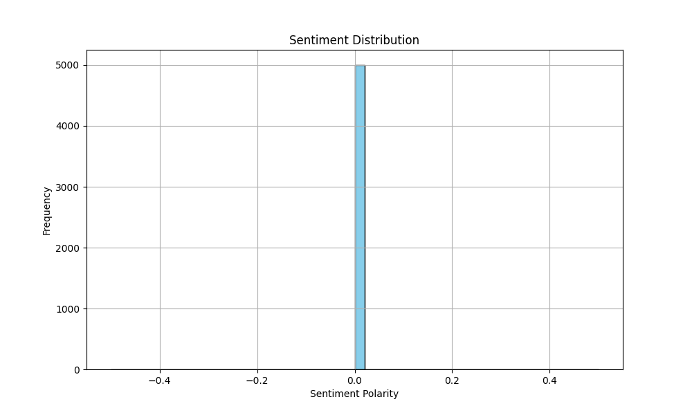
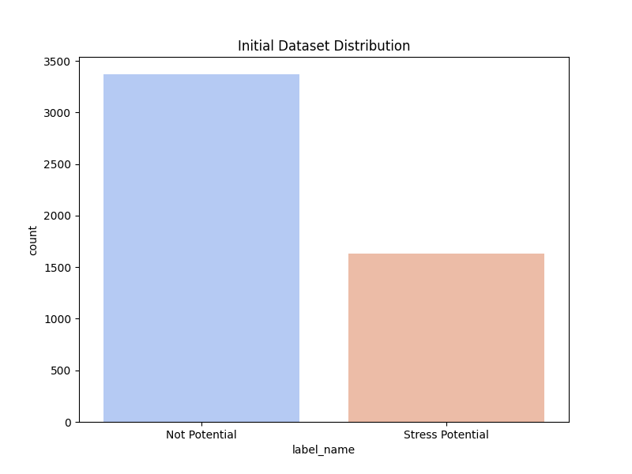
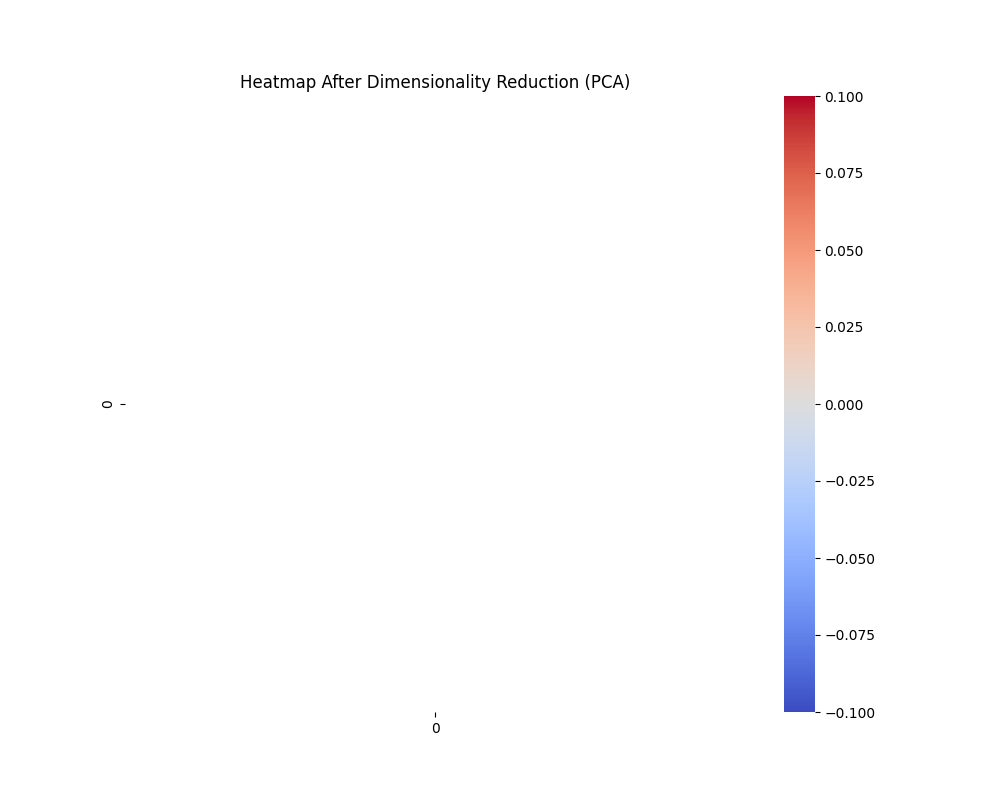
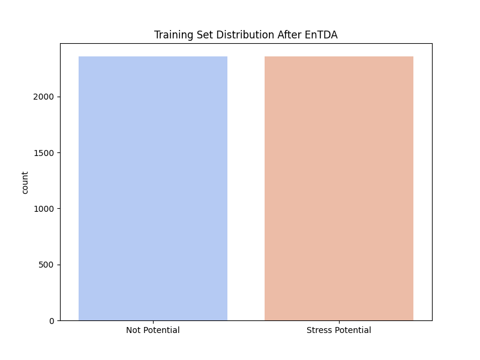
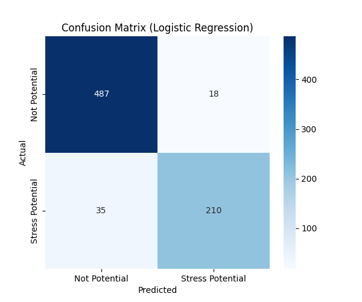

# Indonesian Stress Potential Analysis (EnTDA Augmented)
    
## 0. Dataset Flags
**Sentiment data flags** mapping in this dataset:
- `1`: **Stress Potential (Positif)**
- `0`: **Not Potential**

## 1. Sentiment Distribution
The distribution of text sentiment polarities analyzed via TextBlob.


## 2. Dataset Distribution
Class distribution of Stress Potential vs Not Potential before balancing:


## 3. Heatmap After Dimensionality Reduction (PCA)
Using PCA to extract components from the numerical metadata features:


## 4. WordCloud
Most frequent terms found across all text samples:


## 5. Correlation
Pearsons Correlation between TextBlob Sentiment Score and Actual Stress Potential Label: **nan**

## 6. Shape of Combined Features
- Training, Validation, and Test Split performed: **70% / 15% / 15%**
- Shape of the Training Set *after* applying **EnTDA (Entity-to-Text)** class balancing via Contextual Embeddings: **(4718, 101)**


## 7. Confusion Matrix (Logistic Regression)
Performance on the 15% Test set:


## 8. Learning Rate & Pipeline Params
- **Vectorization**: TF-IDF (100 features) + Sentiment
- **Oversampling**: Entity-to-Text Based Augmentation (EnTDA) on Raw Texts
- **Model**: Logistic Regression
- **Optimization Strategy**: Default LBFGS solver, max_iterations=1000.
*(All inference models including Transformers point to `<pipeline>/models/inference_models/` folder).*

## 9. Classification Report (Logistic Regression Model)
**Accuracy**: 0.9293

```text
                  precision    recall  f1-score   support

   Not Potential       0.93      0.96      0.95       505
Stress Potential       0.92      0.86      0.89       245

        accuracy                           0.93       750
       macro avg       0.93      0.91      0.92       750
    weighted avg       0.93      0.93      0.93       750

```
