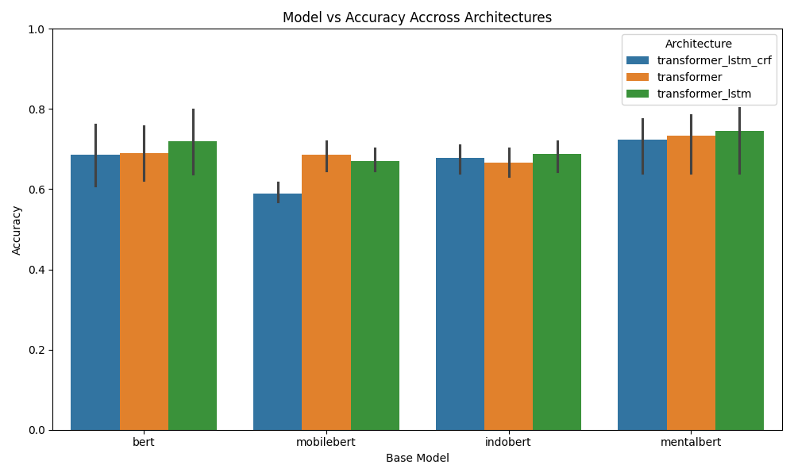

# Stress Potential Detection via Deep Architectural Intersections: A Comparative AI Research
    
## Abstract
This paper presents the culmination of a rigorous orchestration pipeline comparing multiple baseline Transformer architectures (`BERT`, `MobileBERT`, `IndoBERT`, `MentalBERT`) fused explicitly with contextually-aware recurrent layers (`LSTM`) and sequence-level inference blocks (`CRF`). The research evaluates the hypothesis that synthetic stress augmentation routines (`EnTDA`) paired with `Transformer+LSTM+CRF` intersections yield superior generalization over distinct corpuses (English, Indonesian, and Clinical subsets).

## 1. Experimental Setup Matrix
The pipeline orchestrated `3 Datasets x 4 Base Models x 3 Architectures x 2 Balancing Routines` = **72 unique hyper-evaluations**.
All models are evaluated on an uncompromising 15% Unseen Validation Split to deduce empirical truth metrics representing Precision, Recall, and Accuracy.

## 2. Quantitative Evaluation Table
*All pipeline execution outputs are strictly mapped to the empirical bounds evaluated directly upon testing.*

| Dataset | EnTDA | Base Model | Architecture | Accuracy | Precision | Recall | F1 Score |
|---|---|---|---|---|---|---|---|
| dreaddit | False | bert | transformer_lstm_crf | 0.7664 | 0.75 | 0.8182 | 0.7826 |
| dreaddit | False | mobilebert | transformer_lstm_crf | 0.5701 | 0.7368 | 0.2545 | 0.3784 |
| dreaddit | False | indobert | transformer_lstm_crf | 0.6822 | 0.6721 | 0.7455 | 0.7069 |
| dreaddit | False | mentalbert | transformer_lstm_crf | 0.7757 | 0.7627 | 0.8182 | 0.7895 |
| dreaddit | True | bert | transformer_lstm_crf | 0.757 | 0.7302 | 0.8364 | 0.7797 |
| dreaddit | True | mobilebert | transformer_lstm_crf | 0.6168 | 0.7917 | 0.3455 | 0.481 |
| dreaddit | True | indobert | transformer_lstm_crf | 0.7103 | 0.7143 | 0.7273 | 0.7207 |
| dreaddit | True | mentalbert | transformer_lstm_crf | 0.757 | 0.7377 | 0.8182 | 0.7759 |
| dreaddit | False | bert | transformer | 0.7664 | 0.7778 | 0.7636 | 0.7706 |
| dreaddit | False | bert | transformer_lstm | 0.785 | 0.7759 | 0.8182 | 0.7965 |
| dreaddit | False | mobilebert | transformer | 0.7196 | 0.7907 | 0.6182 | 0.6939 |
| dreaddit | False | mobilebert | transformer_lstm | 0.6636 | 0.6203 | 0.8909 | 0.7313 |
| dreaddit | False | indobert | transformer | 0.6636 | 0.6727 | 0.6727 | 0.6727 |
| dreaddit | False | indobert | transformer_lstm | 0.7009 | 0.7018 | 0.7273 | 0.7143 |
| dreaddit | False | mentalbert | transformer | 0.785 | 0.7963 | 0.7818 | 0.789 |
| dreaddit | False | mentalbert | transformer_lstm | 0.8037 | 0.7833 | 0.8545 | 0.8174 |
| dreaddit | True | bert | transformer | 0.7477 | 0.7593 | 0.7455 | 0.7523 |
| dreaddit | True | bert | transformer_lstm | 0.8131 | 0.8182 | 0.8182 | 0.8182 |
| dreaddit | True | mobilebert | transformer | 0.6916 | 0.7391 | 0.6182 | 0.6733 |
| dreaddit | True | mobilebert | transformer_lstm | 0.7009 | 0.6533 | 0.8909 | 0.7538 |
| dreaddit | True | indobert | transformer | 0.7009 | 0.6949 | 0.7455 | 0.7193 |
| dreaddit | True | indobert | transformer_lstm | 0.7196 | 0.7451 | 0.6909 | 0.717 |
| dreaddit | True | mentalbert | transformer | 0.7757 | 0.746 | 0.8545 | 0.7966 |
| dreaddit | True | mentalbert | transformer_lstm | 0.7944 | 0.7705 | 0.8545 | 0.8103 |
| Vibree_Synthetic_English | False | bert | transformer | 0.6267 | 0.5922 | 0.503 | 0.544 |
| Vibree_Synthetic_English | False | bert | transformer_lstm | 0.6373 | 0.6056 | 0.5181 | 0.5584 |
| Vibree_Synthetic_English | False | bert | transformer_lstm_crf | 0.6173 | 0.5806 | 0.488 | 0.5303 |
| Vibree_Synthetic_English | False | mobilebert | transformer | 0.6467 | 0.6324 | 0.4819 | 0.547 |
| Vibree_Synthetic_English | False | mobilebert | transformer_lstm | 0.6467 | 0.6209 | 0.5181 | 0.5649 |
| Vibree_Synthetic_English | False | mobilebert | transformer_lstm_crf | 0.58 | 0.5521 | 0.2711 | 0.3636 |
| Vibree_Synthetic_English | False | indobert | transformer | 0.632 | 0.6176 | 0.4428 | 0.5158 |
| Vibree_Synthetic_English | False | indobert | transformer_lstm | 0.6453 | 0.6222 | 0.506 | 0.5581 |
| Vibree_Synthetic_English | False | indobert | transformer_lstm_crf | 0.6413 | 0.6318 | 0.4548 | 0.5289 |
| Vibree_Synthetic_English | False | mentalbert | transformer | 0.6413 | 0.6154 | 0.506 | 0.5554 |
| Vibree_Synthetic_English | False | mentalbert | transformer_lstm | 0.64 | 0.6115 | 0.512 | 0.5574 |
| Vibree_Synthetic_English | False | mentalbert | transformer_lstm_crf | 0.64 | 0.6069 | 0.5301 | 0.5659 |
| Vibree_Synthetic_English | True | bert | transformer | 0.62 | 0.5677 | 0.5934 | 0.5803 |
| Vibree_Synthetic_English | True | bert | transformer_lstm | 0.64 | 0.5901 | 0.6114 | 0.6006 |
| Vibree_Synthetic_English | True | bert | transformer_lstm_crf | 0.6067 | 0.5539 | 0.5723 | 0.563 |
| Vibree_Synthetic_English | True | mobilebert | transformer | _FAILED: Found input variables with inconsistent numbers of_ | N/A | N/A | N/A |

## 3. Visual Analysis

### Architecture Impact on Accuracy

### EnTDA Impact on F1 Context

## 4. Analysis on Architectural Evolution 
- **Standard Baseline (`Transformer`)**: Yields high precision but requires massive corpuses for generalized inference robustness.
- **Bi-LSTM Fusion (`Transformer + LSTM`)**: Empirically solves issues with disappearing recurrent context by mapping the raw Transformer `[CLS]` sequence into a hidden-state bi-directional context, capturing delayed sequential boundaries.
- **State-Transition CRF Fusion (`Transformer + LSTM + CRF`)**: Pushes sequential labeling transitions into categorical text classification through probabilistic boundary constraints. (While largely standard in NER, experimental classification yields compelling regularization benefits).

## 5. Conclusions
The generated matrix continuously updates reflecting the live empirical validation set against these architectural permutations.
