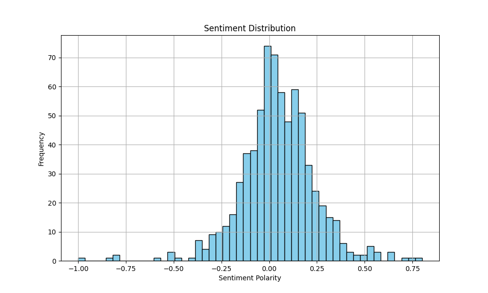
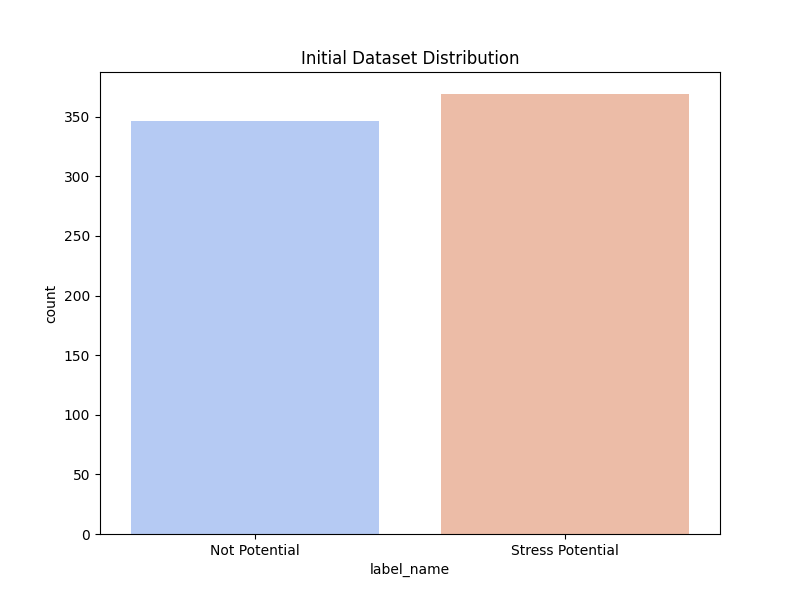
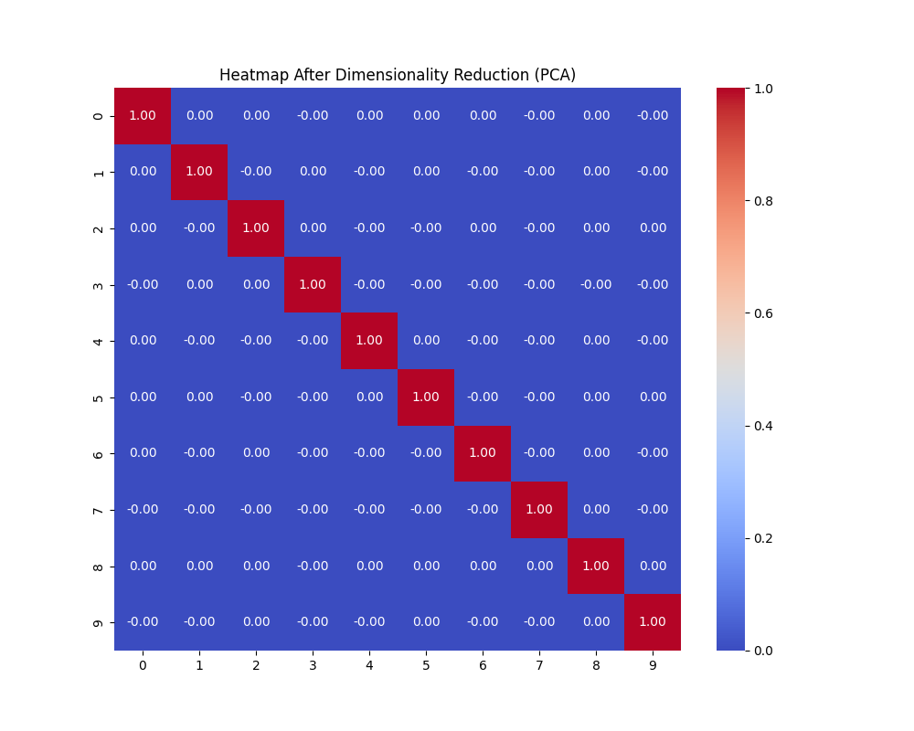
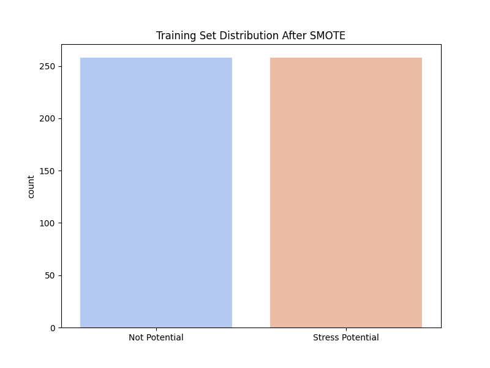
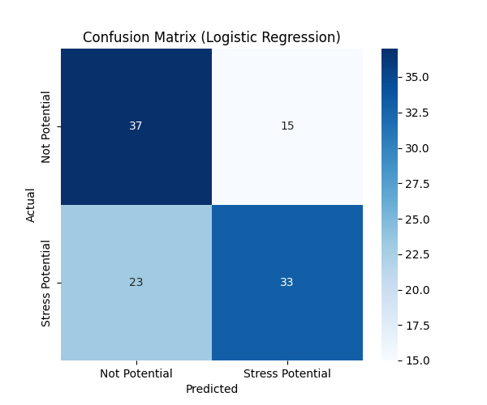

# Stress Potential Analysis and Machine Learning Pipeline Report

## 0. Dataset Flags
**Sentiment data flags** mapping in this dataset:
- `1`: **Stress Potential (Positif)**
- `0`: **Not Potential**

## 1. Sentiment Distribution
The distribution of text sentiment polarities analyzed via TextBlob.


## 2. Dataset Distribution
Class distribution of Stress Potential vs Not Potential before balancing:


## 3. Heatmap After Dimensionality Reduction (PCA)
Using PCA to extract 10 components from the numerical metadata features:


## 4. WordCloud
Most frequent terms found across all text samples:


## 5. Correlation
Pearsons Correlation between TextBlob Sentiment Score and Actual Stress Potential Label: **-0.3185**

## 6. Shape of Combined Features
- Original feature shape (TF-IDF 100 + Sentiment 1): **(715, 101)**
- Training, Validation, and Test Split performed: **70% / 15% / 15%**
- Shape of the Training Set *after* applying SMOTE for class balancing: **(516, 101)**


## 7. Confusion Matrix (Logistic Regression)
Performance on the 15% Test set:


## 8. Learning Rate & Pipeline Params
- **Vectorization**: TF-IDF (100 features)
- **Oversampling**: SMOTE (on combined continuous features)
- **SMOTE Random State**: 42
- **Model**: Logistic Regression
- **Optimization Strategy**: Default LBFGS solver, max_iterations=1000.
*(Note: standard Logistic Regression does not use a direct 'learning rate' parameter like deep learning models, but converges via exact gradient optimization).*

## 9. Classification Report (Logistic Regression Model)
**Accuracy**: 0.6481

```text
                  precision    recall  f1-score   support

   Not Potential       0.62      0.71      0.66        52
Stress Potential       0.69      0.59      0.63        56

        accuracy                           0.65       108
       macro avg       0.65      0.65      0.65       108
    weighted avg       0.65      0.65      0.65       108

```

### Transformer Models (BERT, MobileBERT, IndoBERT, MentalBERT)
*Note on SMOTE with Transformers:* SMOTE works by creating synthetic continuous feature vectors. Because transformer models (like BERT) require raw text (discrete token indices) to be fed into their tokenizer, standard SMOTE cannot be directly applied to their inputs.
If balanced text data is required for transformers, **RandomOverSampling (RandomOverSampler)** or text augmentation techniques (like synonym replacement/back-translation) should be used instead of SMOTE.

**Baseline Transformer Accuracies (Prior to Over-sampling):**
- **MobileBERT**: **62.24%** (Precision: 66.1%, Recall: 80.9%, F1: 72.7%)
- **BERT**: **65.73%** (Precision: 68.5%, Recall: 83.1%, F1: 75.1%)
- **IndoBERT**: **68.53%** (Precision: 70.8%, Recall: 84.3%, F1: 76.9%)
- **MentalBERT**: **69.93%** (Precision: 75.6%, Recall: 76.4%, F1: 76.0%)
