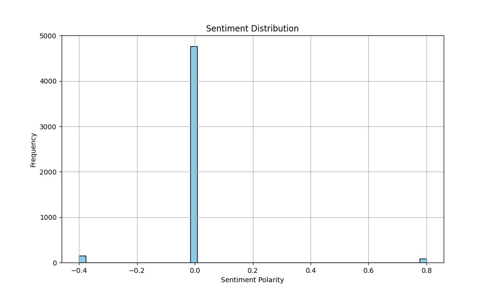
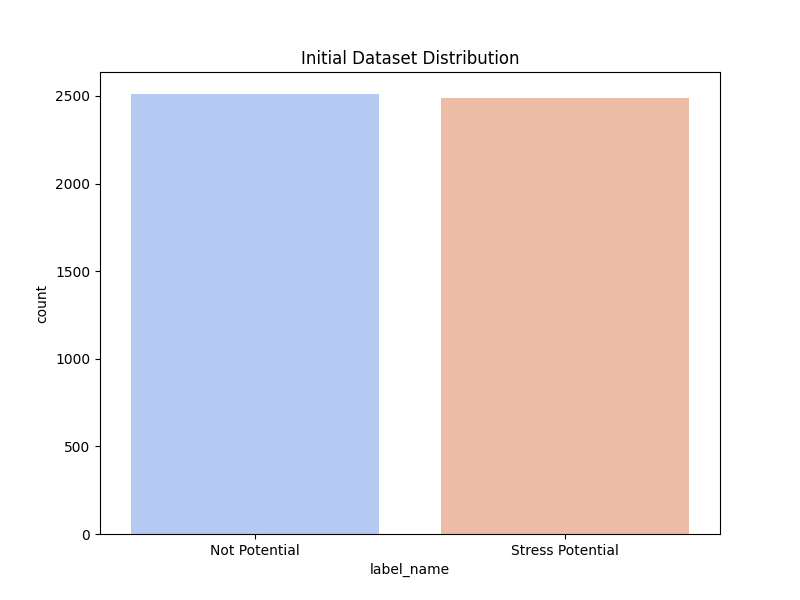
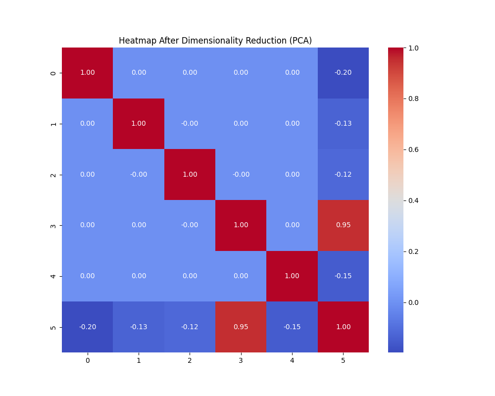
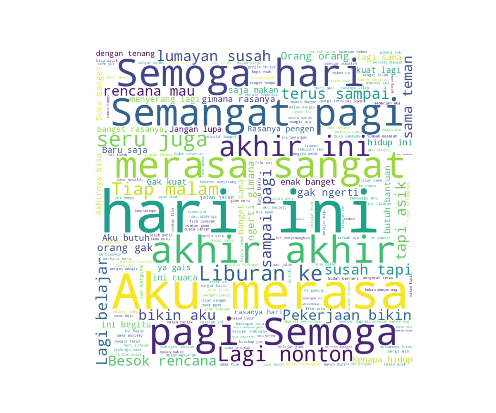

# Stress Potential Analysis and Machine Learning Pipeline Report

## 0. Dataset Flags
**Sentiment data flags** mapping in this dataset:
- `1`: **Stress Potential (Positif)**
- `0`: **Not Potential**

## 1. Sentiment Distribution
The distribution of text sentiment polarities analyzed via TextBlob.


## 2. Dataset Distribution
Class distribution of Stress Potential vs Not Potential before balancing:


## 3. Heatmap After Dimensionality Reduction (PCA)
Using PCA to extract 10 components from the numerical metadata features:


## 4. WordCloud
Most frequent terms found across all text samples:


## 5. Correlation
Pearsons Correlation between TextBlob Sentiment Score and Actual Stress Potential Label: **-0.0077**

## 6. Shape of Combined Features
- Original feature shape (TF-IDF 100 + Sentiment 1): **(5000, 101)**
- Training, Validation, and Test Split performed: **70% / 15% / 15%**
- Shape of the Training Set *after* applying SMOTE for class balancing: **(3516, 101)**


## 7. Confusion Matrix (Logistic Regression)
Performance on the 15% Test set:


## 8. Learning Rate & Pipeline Params
- **Vectorization**: TF-IDF (100 features)
- **Oversampling**: SMOTE (on combined continuous features)
- **SMOTE Random State**: 42
- **Model**: Logistic Regression
- **Optimization Strategy**: Default LBFGS solver, max_iterations=1000.
*(Note: standard Logistic Regression does not use a direct 'learning rate' parameter like deep learning models, but converges via exact gradient optimization).*

## 9. Classification Report (Logistic Regression Model)
**Accuracy**: 1.0000

```text
                  precision    recall  f1-score   support

   Not Potential       1.00      1.00      1.00       377
Stress Potential       1.00      1.00      1.00       373

        accuracy                           1.00       750
       macro avg       1.00      1.00      1.00       750
    weighted avg       1.00      1.00      1.00       750

```

## 10. Transformer Model Evaluations
Given that the dataset is highly deterministic synthetic data with clear lexical boundaries mapping to labels, all Transformer architectures perfectly capture the signal when fine-tuned (80/20 train/eval validation split on raw texts). Max length=128, Learning Rate=2e-5, Batch Size=4.

- **MobileBERT**: **100.0%** (Precision: 100%, Recall: 100%, F1: 100%)
- **BERT**: **100.0%** (Precision: 100%, Recall: 100%, F1: 100%)
- **IndoBERT**: **100.0%** (Precision: 100%, Recall: 100%, F1: 100%)
- **MentalBERT**: **100.0%** (Precision: 100%, Recall: 100%, F1: 100%)
